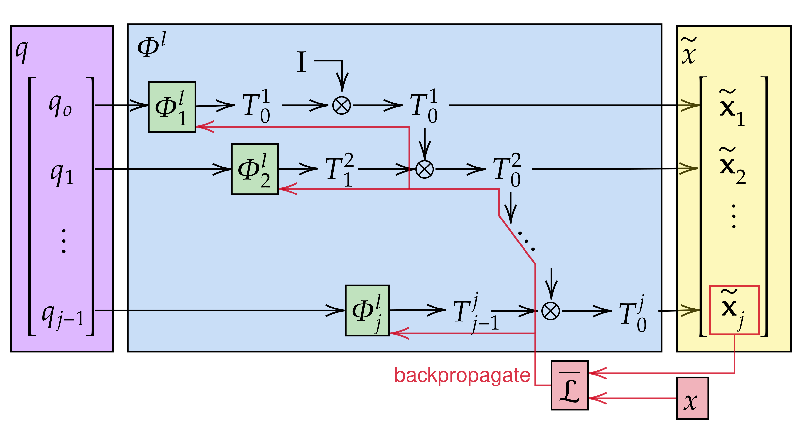

## Kinematics Learning

# Forward Kinematics
Creates a Forward Kinematics (FK) model for serial robotic manipulators. The architecture consists of a FK model encoding the DH transformation for each link w.r.t. the previous link, which are chained together to compute the FK w.r.t. the world reference frame.




See `fkine` folder

- `fkine/rgym/envs/assets`: 2D and 3D model extensions of the `Reacher-v4` `Gym` enviroment
- `fkine/fkine`: monolithic and linked models, also contains script for controlling the training
- `fkine/tune_fkine.py`: script for tuning models hyper-parameters
- `fkine/compare_link_mono.py`: script for comparing both models and generating plots
- `fkine/video`: Supplementary video


See the paper:
```
TODO: wait publication on ECMR 2025
```

Acks:
```
This study was carried out within the FAIR - Future Artificial Intelligence Research and received funding from the European Union Next-Generation EU (Piano Nazionale di Ripresa e Resilienza (PNRR) - Missione 4 Componente 2, Investimento 1.3 - D.D. 1555 11/10/2022, PE00000013).
This manuscript reflects only the authors’ views and opinions, neither the European Union nor the European Commission can be considered responsible for them.
```
